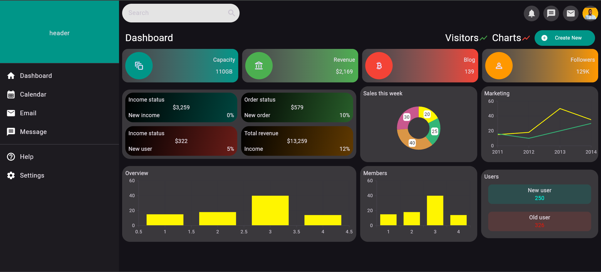
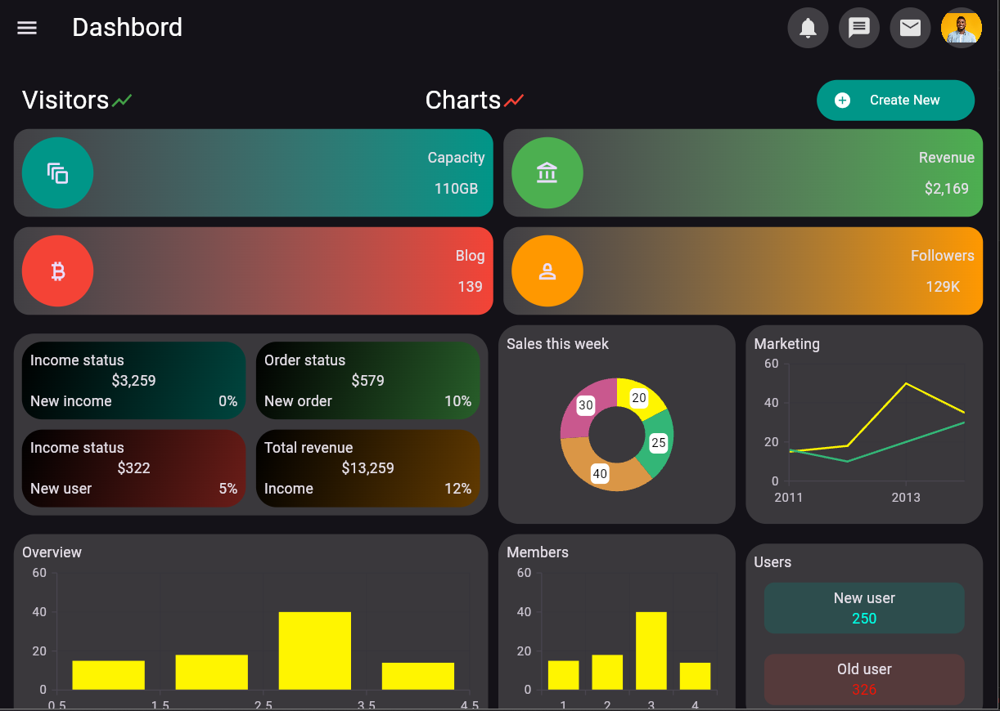
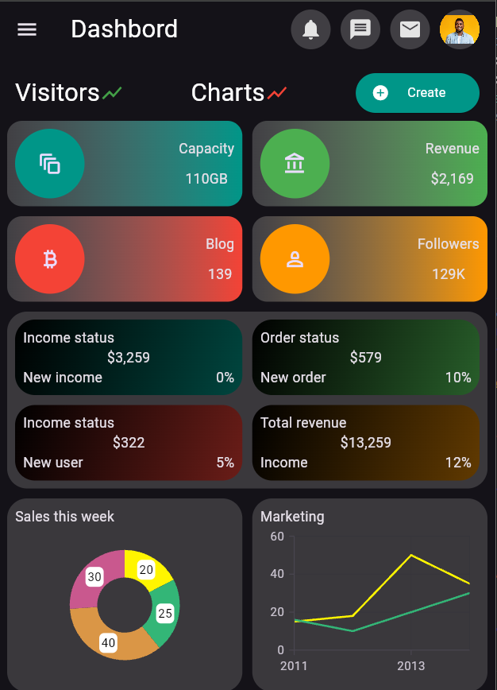
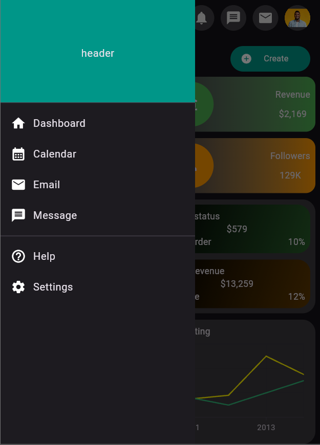

# Flutter Responsive UI Showcase 📱💻

This project demonstrates how I implement **responsive design in Flutter**, making the UI adapt to different screen sizes (mobile, tablet, and web).  

## Features ✅

- Responsive layout for multiple devices  
- Clean and scalable folder structure  
- Flutter best practices  

## Screenshots 📸

  
  

  
  

## Tech Stack 💻

- Flutter  
- Dart  

## Notes 📝

- This project is for **showcase purposes**.  
- Demonstrates my ability to design UIs that work seamlessly across different devices.  
